# MANUAL INTEGRAL DE OPERACIÓN DEL SISTEMA
## CRM de WhatsApp, automatización, ventas, IA e integraciones

**Sistema:** AutomateAI CRM para WhatsApp  
**Versión del manual:** 1.2  
**Fecha:** 22 de septiembre de 2026  
**Idioma de operación:** Español

---

# PARTE I. ATENCIÓN POR IA Y TRANSFERENCIA A EQUIPOS HUMANOS

# 1. OBJETIVO

Este manual explica paso a paso cómo operar todas las funcionalidades disponibles:

1. Consultar indicadores y actividad desde el Panel.
2. Atender conversaciones en la Bandeja de entrada.
3. Administrar contactos, etiquetas, campos y notas.
4. Gestionar oportunidades comerciales mediante pipelines.
5. Crear difusiones con plantillas aprobadas por Meta.
6. Construir automatizaciones y flujos conversacionales.
7. Configurar el asistente de Inteligencia Artificial y su conocimiento.
8. Transferir conversaciones de la IA a equipos humanos.
9. Configurar WhatsApp, plantillas, miembros y permisos.
10. Integrar el CRM mediante API pública, webhooks y MCP.

---

# 2. ALCANCE DE LA DERIVACIÓN Y ASIGNACIÓN AUTOMÁTICA POR IA

El sistema dispone de dos modos de derivación:

1. **Asignación automática por IA inactiva:** todas las derivaciones utilizan el
	destino global definido en **Derivar a**. Puede ser un miembro específico o la
	**Cola sin asignar**. Este es el comportamiento tradicional.
2. **Asignación automática por IA activa:** la IA clasifica el motivo de la
	derivación usando las reglas configuradas y propone el especialista asociado
	al área o intención detectada.

La opción se encuentra en:

**Agentes de IA > Configuración > Habilitar asignación automática por IA**

Cada regla relaciona tres datos:

- **Área:** nombre comprensible para el equipo, por ejemplo, "Facturación".
- **Palabras clave o intención:** descripción de los casos que pertenecen al
  área, por ejemplo, "facturas, cobros, cargos y reembolsos".
- **Especialista:** miembro de la cuenta que recibirá la conversación.

El área es una clasificación lógica, no una cola ni un usuario independiente.
La notificación se envía al especialista vinculado a la regla. Si la IA no puede
elegir un área con claridad, el miembro ya no pertenece a la cuenta o no está
**En línea**, el sistema utiliza automáticamente el destino global de
**Derivar a**. También notifica al propietario cuando el enrutamiento inteligente
necesita atención.

---

# 3. ROLES OPERATIVOS

| Rol | Responsabilidad principal |
|---|---|
| Propietario | Administra la cuenta y puede configurar la IA. |
| Coordinador / Administrador | Revisa y distribuye casos derivados; también configura la IA, miembros, conocimiento y destino de derivación. |
| Agente o especialista | Atiende conversaciones asignadas y responde al cliente. |
| Observador | Consulta información en modo de solo lectura. |
| Asistente de IA | Responde consultas permitidas y solicita la derivación cuando no debe continuar. |

Solo un **Propietario** o **Administrador** debe modificar la configuración general
del asistente de IA.

---

# 4. ESTADOS DE UNA CONVERSACIÓN

| Estado operativo | Responsable | Comportamiento visible |
|---|---|---|
| IA activa | Asistente de IA | Franja: **El asistente de IA está respondiendo automáticamente**. |
| IA pausada por derivación | Humano o cola | Franja: **El asistente de IA está en pausa aquí** y nota interna. |
| Tomada manualmente | Agente que tomó el control | La IA se pausa y la conversación queda asignada al agente. |
| Asignada a una persona | Miembro seleccionado | El nombre del responsable aparece en **Asignar** y la IA no responde. |
| Sin asignar | Equipo compartido | La conversación permanece disponible para que cualquier agente la tome. |
| IA reanudada | Asistente de IA | Se elimina la asignación, se limpia la nota de derivación y se reinicia el contador de respuestas. |

---

# 5. FLUJO GENERAL DE ATENCIÓN

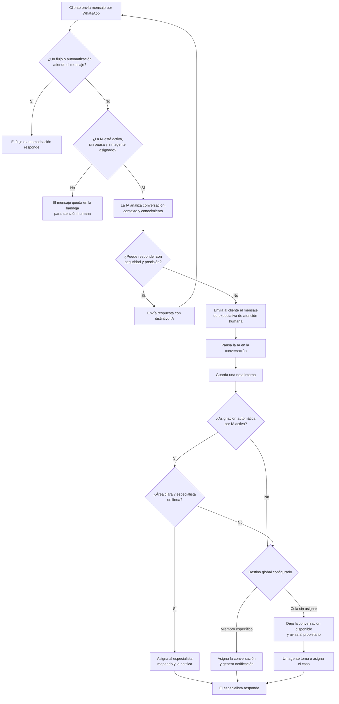

---

# 6. CONFIGURACIÓN INICIAL

## 6.1 Registrar a los miembros del equipo

Antes de configurar la derivación:

1. Ingresar al sistema con rol de Propietario o Coordinador / Administrador.
2. Abrir **Configuración**.
3. Entrar en la sección de miembros del equipo.
4. Invitar a las personas que atenderán conversaciones.
5. Confirmar que cada especialista aparezca como miembro activo.

Para recibir una asignación inteligente, el especialista también debe figurar
**En línea** en el momento de la derivación. Un miembro registrado pero
**Ausente**, **Desconectado** o sin un heartbeat reciente no se considera
disponible y activa el destino global de respaldo.

Ejemplo de organización recomendada:

| Área empresarial | Miembro o función sugerida |
|---|---|
| Ingeniería y Arquitectura | Especialista técnico o coordinador de proyectos. |
| Python e Inteligencia Artificial | Ingeniero de Python/IA. |
| Soporte y Consultoría Humana | Agente de soporte o consultor. |
| Distribución general | Coordinador que reasigna los casos. |

## 6.2 Configurar el asistente de IA

1. Abrir **Agentes de IA**.
2. Seleccionar la pestaña **Configuración**.
3. Elegir el proveedor de IA.
4. Indicar el modelo.
5. Ingresar la clave de API.
6. Pulsar **Probar clave**.
7. Verificar el mensaje: **La clave funciona: el proveedor respondió**.
8. Completar **Contexto del negocio e instrucciones**.
9. Activar **Activar asistente de IA**.
10. Activar **Responder automáticamente a mensajes entrantes**.
11. Elegir un nivel en **Gestión de audio**:
	- **Solo texto**: guarda las notas de voz, pero no las procesa con IA.
	- **Audio inicial**: si el primer mensaje es una nota de voz, la transcribe y
	  responde una vez con voz femenina latina y respetuosa, solicitando continuar
	  por texto. Los audios posteriores se guardan sin procesarse.
	- **Audio completo**: transcribe cada audio y responde con voz; los mensajes
	  escritos continúan recibiendo respuestas de texto.
12. Mantener **Solo texto** para minimizar costos de transcripción, chat y voz.
13. Si el chat usa Anthropic, Gemini u OpenRouter, configurar una **Clave de
	servicios OpenAI** para habilitar audio. Con OpenAI se usa la clave principal.
14. Definir el **Máximo de respuestas automáticas por conversación**.
15. En **Derivar a**, seleccionar el destino global de respaldo:
	- Un coordinador o especialista concreto.
	- **Cola sin asignar (cualquier agente puede tomarlo)**.
16. Para conservar el comportamiento tradicional, dejar desactivado
    **Habilitar asignación automática por IA**.
17. Para usar enrutamiento inteligente, activar
    **Habilitar asignación automática por IA**.
18. Pulsar **Agregar regla** por cada área que deba reconocer la IA.
19. Completar **Área**, **Palabras clave o intención** y **Especialista**.
20. Pulsar **Guardar**.
21. Verificar el mensaje: **Asistente de IA guardado**.

Los audios siempre se reciben, almacenan y muestran en la conversación para el
equipo humano. En **Solo texto**, un audio no construye contexto, no muestra el
indicador de escritura y no llama a ningún proveedor de IA. Si falla la síntesis
de voz después de generar una respuesta, el sistema envía el contenido por texto.

### 6.2.1 Ejemplo de reglas de enrutamiento

| Área | Palabras clave o intención | Especialista |
|---|---|---|
| Facturación | Facturas, cobros, cargos duplicados y reembolsos. | Responsable financiero. |
| Ingeniería | Cotizaciones técnicas, arquitectura e integraciones. | Especialista técnico. |
| Python e IA | Código Python, modelos, datos e infraestructura de IA. | Ingeniero de IA. |
| Soporte humano | Quejas, seguridad, desconfianza o solicitud de una persona. | Agente de soporte. |

Las descripciones deben explicar la intención, no limitarse a una sola palabra.
La IA analiza el sentido de la conversación completa; no funciona únicamente
como una búsqueda literal de palabras clave.

## 6.3 Cargar la base de conocimiento

1. En la configuración de IA, localizar **Base de conocimiento**.
2. Pulsar **Agregar documento**.
3. Escribir un título descriptivo.
4. Agregar políticas, preguntas frecuentes o información de servicios.
5. Pulsar **Guardar documento**.
6. Repetir el proceso para cada tema importante.
7. Si se utilizan embeddings, pulsar **Reindexar** después de cambios relevantes.

La base de conocimiento debe contener hechos y políticas. Las reglas de conducta,
tono y derivación deben permanecer en **Contexto del negocio e instrucciones**.

## 6.4 Definir instrucciones de derivación

Cada caso debe incluir:

- El disparador que obliga a dejar de responder.
- El nombre del área que atenderá al cliente.
- El texto exacto que recibirá el cliente.

Ejemplo:

```text
Cuando el cliente pida una cotización formal, informa:
"Para evaluar la arquitectura técnica de tu proyecto y darte una cotización
exacta, te voy a poner en contacto directo con nuestra Área de Ingeniería y
Arquitectura de Automatización. Un especialista del equipo te escribirá en
breve por este medio."
Después de este mensaje, deriva la conversación a una persona.
```

La aplicación agrega internamente la señal técnica de transferencia. No es
necesario mostrar ni explicar esa señal al cliente.

## 6.5 Probar antes de activar

1. Abrir **Agentes de IA > Playground**.
2. Probar una pregunta normal del catálogo.
3. Confirmar que la IA responda de forma breve y correcta.
4. Probar: "Quiero una cotización formal".
5. Confirmar que aparezca el texto de derivación.
6. Confirmar el indicador: **Aquí derivaría la conversación a una persona**.
7. Probar: "Quiero hablar con una persona real".
8. Confirmar que la IA no continúe interrogando al cliente.
9. Probar una pregunta fuera del alcance de AutomateAI.
10. Confirmar que no invente servicios, precios ni fechas.

El Playground simula la decisión, pero no asigna una conversación real. La
asignación se comprueba con un mensaje real recibido en la Bandeja de entrada.

---

# 7. OPERACIÓN DIARIA

## 7.1 Atención normal por IA

1. El cliente envía un mensaje por WhatsApp.
2. El mensaje aparece en **Bandeja de entrada**.
3. Si no existe un flujo prioritario, una automatización de mensajes activa,
   una pausa o un agente asignado, la IA procesa el mensaje.
4. La IA envía la respuesta.
5. En la conversación, el mensaje automático muestra el distintivo **IA**.
6. En la parte inferior aparece la franja:

```text
┌──────────────────────────────────────────────────────────────┐
│ ✦ El asistente de IA está respondiendo automáticamente       │
│                                      [Tomar el control]       │
└──────────────────────────────────────────────────────────────┘
```

## 7.2 Derivación automática iniciada por la IA

La derivación ocurre cuando la IA determina que no puede o no debe continuar,
por ejemplo:

- El cliente exige hablar con una persona.
- El cliente expresa desconfianza, molestia o una queja.
- Solicita una cotización formal.
- El proyecto requiere arquitectura o integración avanzada.
- Solicita código, infraestructura o modelos complejos a medida.
- La respuesta requiere información que no está disponible.
- La base de conocimiento no permite responder con seguridad.

Secuencia del sistema:

1. La IA redacta el mensaje de cierre de expectativa.
2. El cliente recibe ese mensaje en WhatsApp.
3. El sistema pausa la IA para esa conversación.
4. El sistema guarda una nota interna con el contexto reciente.
5. Si la asignación automática está activa, el prompt interno entrega al modelo
	la lista de claves, áreas e intenciones permitidas.
6. La IA devuelve una clave técnica de enrutamiento junto con la solicitud de
	derivación. Esa clave no se muestra al cliente.
7. El backend comprueba que la clave exista, que el especialista todavía sea
	miembro de la misma cuenta y que su presencia actual sea **En línea**.
8. Si todas las comprobaciones son correctas, asigna la conversación al
	especialista mapeado y genera su notificación.
9. Si no existe una coincidencia clara o el especialista está **Ausente** o
	**Desconectado**, utiliza **Derivar a** como respaldo.
10. Si el respaldo es la cola, deja la conversación sin asignar y notifica al
	 propietario. Si es un miembro, asigna el caso a ese miembro.
11. Cuando el destino inteligente no está disponible, el propietario también
	 recibe la alerta **AI routing fallback needs attention**.
12. El equipo humano abre el hilo y continúa la atención.

La IA no elige libremente cualquier usuario ni conoce IDs de miembros. Solo
puede seleccionar una de las claves de las reglas guardadas por un administrador.
El servidor convierte esa clave en un usuario después de realizar las
validaciones de cuenta y presencia.

## 7.3 Lo que ve el cliente

El cliente solo ve un mensaje normal de WhatsApp. No ve controles internos,
notas, nombres de usuario ni señales técnicas.

Ejemplo:

```text
AutomateBot:
Para evaluar la arquitectura técnica de tu proyecto y darte una cotización
exacta, te voy a poner en contacto directo con nuestra Área de Ingeniería y
Arquitectura de Automatización. Un especialista del equipo te escribirá en
breve por este medio.
```

Después de este mensaje, AutomateBot deja de responder en ese hilo hasta que
un agente pulse **Reanudar IA**.

## 7.4 Lo que ve el equipo dentro del sistema

Al abrir la conversación derivada aparece:

```text
┌──────────────────────────────────────────────────────────────┐
│ El asistente de IA está en pausa aquí                        │
│ Nota interna: resumen de la derivación y último mensaje      │
│                                           [Reanudar IA]       │
└──────────────────────────────────────────────────────────────┘
```

Además:

- El selector **Asignar** muestra el nombre del responsable, si existe.
- La nota de derivación es interna y no se envía al cliente.
- El historial conserva el mensaje enviado por la IA con el distintivo **IA**.
- La persona asignada encuentra una alerta en **Notificaciones**.
- Al pulsar la notificación se abre directamente la conversación.
- Cuando intervino el enrutamiento inteligente, la nota interna indica el área,
	la intención configurada y el resultado de la asignación.
- Si se aplicó el respaldo, la nota explica si faltó un destino claro, la clave
	era desconocida, el miembro fue eliminado o estaba ausente/desconectado.

El área no recibe una alerta separada porque no es una cuenta ni una cola. Se
entera de la asignación la persona vinculada a esa área mediante tres señales:

1. Una notificación de conversación asignada.
2. Su nombre visible en el selector **Asignar** del hilo.
3. La nota interna de derivación con el área y motivo elegidos por la IA.

## 7.5 Distribuir el caso hacia otra área

### 7.5.1 Quién recibe la notificación

El destinatario depende del modo y del resultado de las validaciones:

| Situación | Resultado | Persona notificada |
|---|---|---|
| Asignación automática inactiva y miembro global | El chat se asigna al destino de **Derivar a**. | El miembro global. |
| Asignación automática inactiva y cola global | El chat queda pausado y sin responsable. | El Propietario coordinador. |
| Regla clara y especialista en línea | El chat se asigna al miembro mapeado para el área. | El especialista seleccionado por la IA. |
| Regla ambigua o inexistente | Se utiliza el destino global de **Derivar a**. | El miembro global o el Propietario si es cola. |
| Especialista ausente, desconectado o eliminado | Se utiliza el destino global y se registra el motivo. | Destino global y Propietario por alerta de fallback. |

La notificación de cola se muestra con el título interno
**AI handoff needs assignment**. Al abrirla, el sistema dirige al coordinador a
la conversación correspondiente. El cuerpo contiene el resumen generado por el
sistema y el último mensaje relevante del cliente.

### 7.5.2 Procedimiento del coordinador

1. Abrir **Notificaciones** desde el menú lateral.
2. Localizar la alerta **AI handoff needs assignment** o
	**AI routing fallback needs attention** marcada como **Sin leer**.
3. Pulsar la alerta. Esta acción la marca como leída y abre la conversación.
4. Confirmar que la franja indique **El asistente de IA está en pausa aquí**.
5. Leer la nota interna de derivación.
6. Revisar el último mensaje del cliente y las respuestas anteriores de la IA.
7. Clasificar la solicitud con la matriz del capítulo 9:
   - Cotización, arquitectura o integración: Ingeniería y Arquitectura.
   - Código, modelos o infraestructura: Python e Inteligencia Artificial.
   - Persona real, confianza, seguridad o queja: Soporte y Consultoría Humana.
8. En la cabecera del hilo, pulsar **Asignar**.
9. Seleccionar al especialista responsable del área correspondiente.
10. Confirmar que su nombre aparezca en la cabecera de la conversación.
11. El especialista recibe una nueva notificación de asignación.
12. Verificar que el especialista abra el hilo y responda al cliente.

### 7.5.3 Cuándo se considera resuelta la notificación

Marcar la alerta como leída no completa la derivación. El coordinador debe
confirmar estos cuatro puntos:

- La conversación tiene un especialista asignado.
- El especialista correcto recibió la notificación.
- La IA permanece pausada durante la intervención humana.
- El cliente recibió o recibirá una respuesta humana.

Si no hay un especialista disponible, mantener la IA pausada, dejar el chat sin
asignar o asignarlo temporalmente al coordinador y registrar el seguimiento
interno. No pulsar **Reanudar IA** para eliminar una solicitud pendiente.

### 7.5.4 Reasignación o clasificación incorrecta

1. Abrir nuevamente la conversación.
2. Pulsar el nombre actual en **Asignar**.
3. Elegir al especialista correcto.
4. Confirmar la nueva asignación.
5. Avisar internamente al responsable anterior si ya había iniciado la gestión.
6. Registrar el error de clasificación para ajustar las instrucciones de IA.

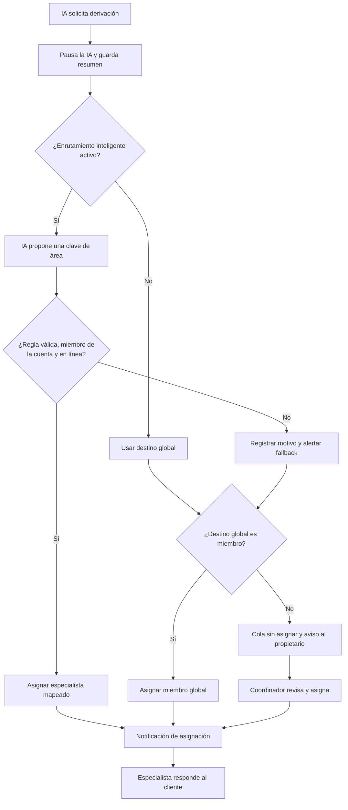

## 7.6 Tomar el control antes de una derivación

Un agente puede detener la IA sin esperar a que esta solicite ayuda:

1. Abrir una conversación atendida por la IA.
2. Localizar la franja **El asistente de IA está respondiendo automáticamente**.
3. Pulsar **Tomar el control**.
4. El sistema pausa la IA.
5. La conversación queda asignada al agente que realizó la acción.
6. Aparece la confirmación: **Tomaste el control de este chat**.
7. El agente puede responder desde el compositor de mensajes.

## 7.7 Reanudar la IA

Reanudar únicamente cuando la intervención humana haya terminado y sea seguro
que el bot continúe.

1. Abrir la conversación pausada.
2. Verificar que no exista una gestión humana pendiente.
3. Pulsar **Reanudar IA**.
4. Confirmar el mensaje: **IA reanudada**.

Esta acción:

- Quita la pausa de la IA.
- Elimina la asignación humana actual.
- Limpia la nota interna de derivación.
- Reinicia el contador de respuestas automáticas del hilo.

El siguiente mensaje entrante del cliente podrá ser atendido nuevamente por la IA.

---

# 8. SECUENCIA DE TRANSFERENCIA

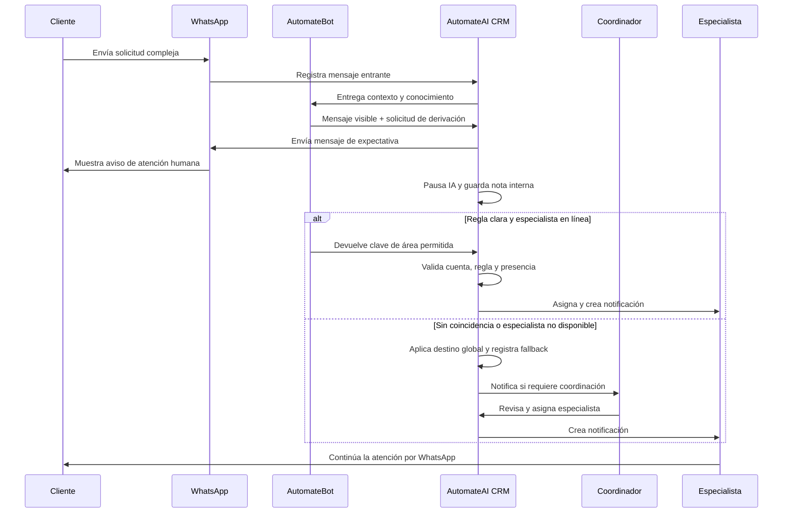

---

# 9. MATRIZ DE DERIVACIÓN DE AUTOMATEAI

| Situación detectada | Mensaje al cliente | Área comunicada | Destino dentro del CRM |
|---|---|---|---|
| Cotización formal, arquitectura o múltiples integraciones | Mensaje de evaluación técnica y cotización | Ingeniería y Arquitectura de Automatización | Especialista mapeado si está en línea; de lo contrario, destino global. |
| Python avanzado, modelos a medida, infraestructura local o datos críticos | Mensaje de asesoría especializada | Expertos en Python e Inteligencia Artificial | Especialista mapeado si está en línea; de lo contrario, destino global. |
| Solicitud de humano, resistencia al bot, seguridad o fiabilidad | Mensaje de seguridad y atención personalizada | Soporte y Consultoría Humana | Especialista mapeado si está en línea; de lo contrario, destino global. |
| Pregunta fuera del catálogo | Explicación del alcance de AutomateAI | Coordinación comercial o soporte | Destino global según configuración. |

Importante: **Área comunicada** y **Destino dentro del CRM** solo coinciden cuando
existe una regla válida para esa área y el especialista está en línea. El selector
**Derivar a** continúa siendo el respaldo obligatorio para todos los demás casos.

---

# 10. ÁRBOL DE DECISIÓN DEL OPERADOR

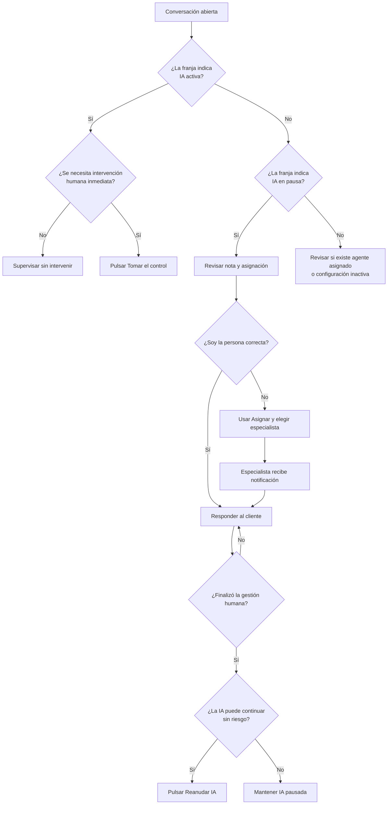

---

# 11. COMPROBACIÓN DE FUNCIONAMIENTO

Realizar estas pruebas después de configurar o modificar las instrucciones:

## Prueba A: respuesta normal

1. Enviar una pregunta incluida en la base de conocimiento.
2. Confirmar que la IA responda.
3. Confirmar el distintivo **IA**.
4. Confirmar que la franja continúe indicando IA activa.

## Prueba B: cotización formal

1. Enviar: "Necesito una cotización formal para integrar varios sistemas".
2. Confirmar que el cliente reciba el mensaje de Ingeniería y Arquitectura.
3. Confirmar que la IA quede pausada.
4. Confirmar que aparezca una nota interna.
5. Confirmar la asignación o presencia en la cola.
6. Confirmar la notificación al responsable, cuando corresponda.

## Prueba C: solicitud de persona real

1. Enviar: "No quiero hablar con un bot; necesito una persona".
2. Confirmar el mensaje de Soporte y Consultoría Humana.
3. Confirmar que la IA no vuelva a responder en ese hilo.

## Prueba D: reasignación entre áreas

1. Abrir un caso derivado.
2. Pulsar **Asignar**.
3. Elegir otro miembro.
4. Confirmar que el nuevo nombre aparezca en el hilo.
5. Confirmar que el nuevo responsable reciba la notificación.

## Prueba E: reanudación

1. Abrir un hilo pausado de prueba.
2. Pulsar **Reanudar IA**.
3. Enviar un nuevo mensaje desde WhatsApp.
4. Confirmar que la IA vuelva a responder.

## Prueba F: asignación automática por área y fallback

1. Activar **Habilitar asignación automática por IA**.
2. Crear una regla de prueba y asociarla a un especialista en línea.
3. Enviar un mensaje que coincida claramente con la intención configurada.
4. Confirmar que el especialista aparezca en **Asignar**, reciba una notificación
	y que la nota interna mencione el área seleccionada.
5. Cambiar al especialista a **Ausente** o cerrar su sesión hasta que figure
	**Desconectado**.
6. Repetir el escenario con una conversación nueva.
7. Confirmar que se utilice **Derivar a**, que la nota explique el fallback y que
	el propietario reciba **AI routing fallback needs attention**.
8. Desactivar la asignación automática y repetir una vez más.
9. Confirmar que la conversación vaya directamente al destino global sin intentar
	clasificarla por área.

---

# 12. SOLUCIÓN DE PROBLEMAS

## La IA no responde

Revisar, en este orden:

1. ¿Está activo **Activar asistente de IA**?
2. ¿Está activo **Responder automáticamente a mensajes entrantes**?
3. ¿La conversación tiene un agente asignado? Si lo tiene, la IA no responde.
4. ¿La conversación muestra **El asistente de IA está en pausa aquí**?
5. ¿Existe un flujo que ya consumió el mensaje?
6. ¿Existe una automatización activa de mensaje recibido o coincidencia de palabra?
7. ¿Se alcanzó el máximo de respuestas automáticas del hilo?
8. ¿La clave y el proveedor de IA funcionan?

## La conversación alcanzó el máximo de respuestas

El máximo de respuestas es un límite de seguridad. Al alcanzarlo, AutomateAI no
deja al cliente en silencio: pausa la IA, envía un aviso de continuidad humana y
asigna el hilo al destino global de **Derivar a**. Si el destino es la cola sin
asignar, notifica al propietario para que coordine la atención.

Los saludos respondidos localmente, como **Hola** o **Buenas tardes**, no consumen
este contador porque no llaman al proveedor de IA.

Acción operativa:

1. Abrir la conversación pausada y leer la nota interna de límite alcanzado.
2. Atenderla con **Tomar el control** o desde el miembro asignado.
3. Usar **Reanudar IA** únicamente si se desea quitar la asignación, reiniciar el
	contador y devolver la conversación al asistente automático.

## La IA se pausó pero nadie recibió notificación

1. Revisar **Agentes de IA > Configuración > Derivar a**.
2. Revisar si **Habilitar asignación automática por IA** está activo.
3. Si está activo, confirmar que la regla tenga área, intención y especialista.
4. Confirmar que el especialista esté **En línea**. Ausente o desconectado activa
	el destino de respaldo.
5. Si está seleccionada la **Cola sin asignar**, no existe un destinatario individual.
6. Un coordinador debe abrir la bandeja y asignar el caso.
7. Para notificación directa de respaldo, seleccionar un miembro específico en
	**Derivar a**.

## La IA sigue sin responder después de reanudar

1. Actualizar la conversación con el botón de actualización.
2. Confirmar que el selector **Asignar** no muestre un responsable.
3. Confirmar que la franja indique IA activa.
4. Revisar que no exista un flujo o automatización que tenga prioridad.
5. Probar la clave del proveedor desde la configuración de IA.

## Se transfirió al área incorrecta

1. Abrir la conversación.
2. Leer la solicitud original.
3. Pulsar **Asignar**.
4. Elegir al especialista correcto.
5. Corregir la descripción de **Palabras clave o intención** de la regla; agregar
	contexto que diferencie esa área de las demás.
6. Revisar que no existan reglas con descripciones ambiguas o solapadas.
7. Ajustar las instrucciones de negocio si el mensaje al cliente fue incorrecto.
8. Repetir el escenario con una conversación real, ya que el Playground simula
	la derivación pero no ejecuta una asignación.

## Un saludo provocó una derivación

Un mensaje compuesto únicamente por un saludo, por ejemplo **Hola**, **Buenos
días** o **Hola, buenas tardes**, no debe activar una derivación. AutomateAI lo
responde con una pregunta breve para conocer la necesidad del cliente, sin
consultar la base de conocimiento ni llamar al modelo de IA. Esto evita que un
ejemplo del contexto del negocio, una conversación anterior o una regla de
enrutamiento se interpreten como la intención actual del cliente.

Un saludo que también incluye una solicitud concreta, por ejemplo **Hola,
necesito una cotización**, sí continúa por el flujo normal de IA y puede derivarse
si la solicitud cumple las reglas configuradas.

Si una conversación quedó pausada por una derivación anterior incorrecta:

1. Abrir el hilo afectado.
2. Pulsar **Reanudar IA** en la franja inferior.
3. Confirmar que desaparezca el estado **El asistente de IA está en pausa aquí**.
4. Enviar un saludo desde una conversación nueva para comprobar que AutomateAI
	pregunte cómo puede ayudar y no derive el caso.

---

# 13. BUENAS PRÁCTICAS

- Mantener los mensajes de derivación breves y sin prometer una hora exacta.
- No indicar que la transferencia fue completada si no existe un destino configurado.
- Configurar un coordinador cuando existan varias áreas de atención.
- Mantener siempre un destino global válido en **Derivar a**, aunque la asignación
	automática esté activa.
- Escribir reglas mutuamente distinguibles y asociarlas solo a miembros que
	atiendan activamente esa área.
- Revisar las alertas **AI routing fallback needs attention** para detectar
	especialistas ausentes o reglas poco claras.
- Revisar diariamente la cola sin asignar.
- No pulsar **Reanudar IA** mientras un especialista esté trabajando el caso.
- Actualizar la base de conocimiento cuando cambien políticas o servicios.
- Probar todos los disparadores después de editar las instrucciones.
- Mantener bajo control el máximo de respuestas automáticas.
- No compartir claves de API ni información interna en conversaciones.
- Cerrar o marcar como pendiente cada conversación según el proceso interno.

---

# 14. LISTA DE VERIFICACIÓN DIARIA

## Inicio de jornada

- [ ] Revisar **Notificaciones**.
- [ ] Revisar conversaciones sin asignar.
- [ ] Confirmar que la IA se encuentre activa.
- [ ] Confirmar que el coordinador de derivaciones esté disponible.

## Durante la jornada

- [ ] Atender notificaciones de asignación.
- [ ] Distribuir casos hacia el especialista adecuado.
- [ ] Vigilar conversaciones no leídas que hayan alcanzado el límite.
- [ ] Mantener pausada la IA durante la intervención humana.

## Cierre de jornada

- [ ] Revisar la cola sin asignar.
- [ ] Confirmar que no queden derivaciones sin respuesta.
- [ ] Reasignar casos pendientes al responsable del siguiente turno.
- [ ] Registrar errores de clasificación para mejorar las instrucciones.

---

# PARTE II. OPERACIÓN DE TODOS LOS MÓDULOS DEL CRM

# 15. MAPA FUNCIONAL DEL SISTEMA

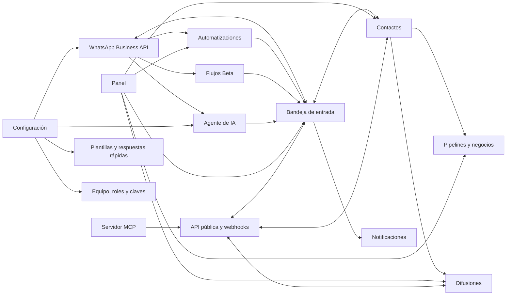

## Navegación principal

| Sección | Propósito |
|---|---|
| Panel | Consultar métricas, gráficos, actividad y accesos rápidos. |
| Bandeja de entrada | Leer, responder, asignar y clasificar conversaciones. |
| Notificaciones | Atender conversaciones asignadas. |
| Contactos | Mantener la base de clientes y sus datos. |
| Pipelines | Gestionar oportunidades y valor comercial. |
| Difusiones | Enviar campañas mediante plantillas aprobadas. |
| Automatizaciones | Ejecutar acciones por eventos y condiciones. |
| Flujos | Diseñar conversaciones ramificadas. Funcionalidad Beta. |
| Agentes de IA | Configurar, probar y supervisar el asistente. |
| Configuración | Administrar cuenta, WhatsApp, plantillas, equipo e integraciones. |

---

# 16. ACCESO, SESIÓN Y PERMISOS

## 16.1 Iniciar sesión

1. Abrir la URL del CRM.
2. Ingresar correo electrónico y contraseña.
3. Pulsar **Iniciar sesión**.
4. Si se olvidó la contraseña, seleccionar **¿Olvidaste tu contraseña?**.
5. Seguir el enlace recibido por correo para establecer una contraseña nueva.

## 16.2 Matriz de permisos

| Acción | Propietario | Coordinador / Administrador | Agente | Observador |
|---|---:|---:|---:|---:|
| Consultar datos | Sí | Sí | Sí | Sí |
| Enviar mensajes y operar módulos | Sí | Sí | Sí | No |
| Editar configuración del espacio | Sí | Sí | No | No |
| Invitar, quitar o cambiar roles | Sí | Sí | No | No |
| Configurar WhatsApp, plantillas e IA | Sí | Sí | No | No |
| Transferir propiedad | Sí | No | No | No |
| Eliminar la cuenta | Sí | No | No | No |

Si el sistema no puede cargar el rol, todas las acciones se tratan como solo
lectura hasta restablecer la conexión y volver a cargar los permisos.

## 16.3 Cerrar sesiones

1. Abrir el menú de usuario.
2. Seleccionar **Cerrar sesión** para salir del dispositivo actual.
3. Para cerrar todas las sesiones, abrir **Configuración > Acceso y seguridad**.
4. Usar la opción de cierre global de sesiones.

---

# 17. PANEL DE CONTROL

El **Panel** resume la operación en tiempo real.

## 17.1 Indicadores principales

- Conversaciones activas.
- Contactos nuevos del día.
- Valor de negocios abiertos.
- Mensajes enviados durante el día.
- Comparación con el día anterior.

## 17.2 Gráficos

- **Conversaciones a lo largo del tiempo:** mensajes entrantes y salientes.
- **Valor del pipeline:** negocios abiertos agrupados por etapa.
- **Tiempo promedio de primera respuesta:** minutos hasta la primera atención.
- **Actividad reciente:** mensajes, negocios, difusiones y automatizaciones.

## 17.3 Acciones rápidas

1. Abrir **Panel**.
2. Elegir **Nuevo contacto**, **Nuevo negocio**, **Nueva difusión** o
	 **Nueva automatización**.
3. Completar el formulario del módulo correspondiente.

Cuando una tarjeta o gráfico está vacío, no representa necesariamente un error:
puede significar que todavía no existe actividad para el período consultado.

---

# 18. BANDEJA DE ENTRADA Y CONVERSACIONES

## 18.1 Localizar una conversación

1. Abrir **Bandeja de entrada**.
2. Buscar por nombre o datos del contacto.
3. Filtrar por **Todas**, **Sin leer**, **Abiertas**, **Pendientes** o **Cerradas**.
4. Aplicar filtros de etiquetas o empresa cuando sea necesario.
5. Seleccionar la conversación en la lista.

## 18.2 Responder un mensaje

1. Escribir en el compositor inferior.
2. Usar `Shift+Enter` para crear una nueva línea.
3. Pulsar **Enviar**.
4. Revisar el estado de entrega del mensaje.

Acciones disponibles:

- Responder a un mensaje específico.
- Copiar texto.
- Reaccionar con un emoji.
- Enviar una foto, video, documento, audio o nota de voz.
- Enviar botones o listas interactivas.
- Insertar una respuesta rápida.
- Enviar una plantilla aprobada.
- Solicitar un borrador con IA y editarlo antes de enviarlo.

## 18.3 Regla de la ventana de 24 horas

Cuando la sesión de atención está vigente se pueden enviar mensajes libres. Si
el indicador muestra **Expirada**, debe utilizarse una plantilla aprobada para
reiniciar la conversación conforme a las reglas de WhatsApp.

## 18.4 Cambiar estado

1. Abrir el selector de estado en la cabecera.
2. Elegir **Abierta**, **Pendiente** o **Cerrada**.
3. Usar **Pendiente** cuando se espera una acción futura.
4. Usar **Cerrada** cuando la gestión terminó.

Al cerrar una conversación se conserva el responsable como historial, pero la
conversación deja de incluirse en el contador personal de asignaciones activas.
Ese contador solo incluye conversaciones asignadas con estado **Abierta** o
**Pendiente**.

### Iniciar una nueva sesión con el mismo contacto

AutomateAI conserva una sola conversación por contacto para mantener todo el
historial en un mismo hilo. Una nueva atención no crea otro registro de
conversación: crea una sesión nueva dentro de ese hilo.

La sesión nueva comienza de cualquiera de estas formas:

1. Marcar la conversación como **Cerrada** y esperar un nuevo mensaje del cliente;
	el webhook la cambia automáticamente a **Abierta**.
2. Abrir el filtro **Cerradas**, seleccionar el hilo y cambiar manualmente el
	estado a **Abierta** o **Pendiente**.

Al pasar de **Cerrada** a un estado activo, el sistema:

- Conserva todos los mensajes y el responsable asignado.
- Reinicia a cero el contador **Máximo de respuestas automáticas por conversación**.
- Quita la pausa y la nota de derivación de la sesión de IA anterior.

Si se conserva un responsable asignado, la IA automática permanece sin responder
porque la persona asignada tiene prioridad. Para devolver la sesión a la IA se
debe pulsar **Quitar asignación** o **Reanudar IA**, según el estado mostrado.

Para iniciar el contacto desde la empresa fuera de la ventana de 24 horas se debe
enviar una plantilla aprobada; abrir el estado del hilo no reemplaza esta regla de
WhatsApp.

## 18.5 Asignar una conversación

1. Pulsar **Asignar** en la cabecera.
2. Revisar la presencia del equipo: en línea, ausente o desconectado.
3. Seleccionar un miembro.
4. Para devolver el hilo a la cola compartida, pulsar **Quitar asignación**.

La asignación crea una notificación para el nuevo responsable. La presencia de
un agente asignado también impide que la respuesta automática de IA intervenga.

## 18.6 Panel del contacto

Desde el lateral de la conversación se puede:

- Consultar información del contacto.
- Agregar o quitar etiquetas.
- Crear y leer notas internas.
- Consultar negocios asociados.
- Abrir la ficha completa del contacto.

## 18.7 Actualizar el hilo

Si un mensaje o cambio de asignación no aparece por una interrupción de tiempo
real, pulsar el icono **Actualizar conversación** en la cabecera.

---

# 19. NOTIFICACIONES

Las notificaciones internas informan asignaciones de conversaciones y
derivaciones de IA que permanecen en la cola sin asignar.

## 19.1 Tipos de notificación

| Notificación | Destinatario | Acción requerida |
|---|---|---|
| Conversación asignada | Agente o especialista seleccionado | Abrir el hilo y atender al cliente. |
| **AI handoff needs assignment** | Propietario de la cuenta | Revisar la solicitud y asignarla al área especializada. |

El menú lateral muestra permanentemente un contador junto a **Notificaciones**:

- Contador neutro `0`: no existen derivaciones de IA pendientes de asignar.
- Contador ámbar: conversaciones derivadas por IA que siguen pausadas y sin
	responsable, con estado **Abierta** o **Pendiente**. Las conversaciones
	**Cerradas** no se incluyen.
- Contador con el color principal: conversaciones **Abiertas** o **Pendientes**
	asignadas al usuario actual.
- `99+`: existen más de 99 elementos en el contador correspondiente.

El contador ámbar no representa notificaciones sin leer. Abrir o marcar una
alerta como leída no lo reduce; solo disminuye cuando se asigna la conversación
a un especialista o se reanuda explícitamente la IA. El contador personal
disminuye cuando una conversación asignada se cierra o se quita su asignación.

### Cómo sabe el especialista que debe atender

1. El coordinador selecciona al especialista en **Asignar**.
2. El sistema crea una notificación personal para ese especialista.
3. Mientras la aplicación esté abierta, aparece el aviso **Nueva conversación
	asignada para atender**, con el botón **Atender ahora**.
4. En su sidebar, **Notificaciones** muestra cuántas conversaciones activas tiene
	asignadas.
5. El especialista puede pulsar **Atender ahora** o abrir **Notificaciones** y
	seleccionar **Conversación asignada para atender**.
6. El sistema marca la alerta como leída y abre directamente el chat del cliente.
7. El especialista verifica la nota interna, mantiene la IA pausada y responde.

Si el especialista tiene habilitadas las notificaciones del navegador, también
puede recibir avisos de nuevos mensajes mientras la aplicación permanezca abierta.

## 19.2 Consultar una notificación

1. Abrir **Notificaciones**.
2. Elegir la pestaña según el estado actual de la conversación:
	**Abiertas**, **Pendientes** o **Cerradas**.
3. Revisar la cantidad indicada junto al nombre de cada pestaña.
4. Identificar elementos marcados **Sin leer**.
5. Pulsar una notificación para marcarla como leída y abrir el hilo asociado.
6. Usar **Marcar todas como leídas** para limpiar los indicadores de lectura.

Cuando cambia el estado de una conversación, sus notificaciones se trasladan
automáticamente a la pestaña correspondiente. La pestaña no depende de si la
notificación fue leída: una conversación cerrada siempre aparece en
**Cerradas**, y una conversación reabierta vuelve a **Abiertas**.

Aunque una conversación haya sido reasignada varias veces, la lista muestra una
sola entrada con su notificación más reciente. Cerrar una conversación mueve
únicamente esa entrada a **Cerradas**; las demás conservan su estado.

Las notificaciones aparecen en tiempo real. También se pueden activar avisos del
navegador desde Configuración; estos requieren permiso del navegador y que la
aplicación permanezca abierta.

## 19.3 Resolver una solicitud de área especializada

1. Abrir la alerta **AI handoff needs assignment**.
2. Revisar la nota de derivación y el último mensaje del cliente.
3. Confirmar que la IA esté pausada.
4. Determinar el área responsable.
5. Pulsar **Asignar** en la cabecera de la conversación.
6. Seleccionar al especialista.
7. Confirmar la nueva asignación y la atención del cliente.

La alerta leída solo indica que fue consultada. La resolución operativa ocurre
cuando el caso queda asignado y el especialista continúa la conversación.

## 19.4 Si el coordinador no recibe la alerta

1. Confirmar que **Derivar a** esté configurado como **Cola sin asignar
	(notificar al propietario)**.
2. Confirmar que el usuario que revisa sea el Propietario de la cuenta.
3. Revisar la Bandeja de entrada y buscar conversaciones con la franja de IA en
	pausa y sin nombre en **Asignar**.
4. Actualizar la página para descartar una interrupción de tiempo real.
5. Si se configuró un miembro específico, revisar las notificaciones de ese
	miembro: el propietario no recibe una segunda alerta en ese caso.

---

# 20. CONTACTOS

## 20.1 Crear un contacto

1. Abrir **Contactos**.
2. Pulsar **Agregar contacto**.
3. Ingresar el teléfono en formato internacional E.164, por ejemplo `+573001234567`.
4. Completar nombre, correo y empresa cuando estén disponibles.
5. Agregar etiquetas.
6. Guardar.

El teléfono identifica al contacto. Antes de crear registros repetidos, buscar
por teléfono y atender las advertencias de posibles duplicados.

## 20.2 Buscar y filtrar

1. Escribir nombre, teléfono o correo en el buscador.
2. Aplicar una o varias etiquetas.
3. Limpiar los filtros para recuperar la lista completa.

## 20.3 Editar la ficha

Desde el detalle del contacto se puede:

- Modificar datos básicos.
- Agregar notas internas.
- Aplicar etiquetas.
- Completar campos personalizados.
- Consultar actividad y conversaciones.
- Consultar o crear negocios asociados.
- Enviar una plantilla de WhatsApp.
- Eliminar el contacto cuando corresponda.

## 20.4 Importar contactos por CSV

1. Abrir **Contactos**.
2. Pulsar **Importar**.
3. Seleccionar un archivo CSV.
4. Incluir una columna de teléfono y revisar el formato solicitado por la pantalla.
5. Mapear o validar las columnas disponibles.
6. Revisar registros válidos, duplicados y errores.
7. Confirmar la importación.

Antes de una importación grande se recomienda probar con una muestra pequeña y
normalizar todos los teléfonos a E.164.

---

# 21. ETIQUETAS Y CAMPOS PERSONALIZADOS

## 21.1 Crear etiquetas

1. Abrir **Configuración > Campos y etiquetas**.
2. Escribir el nombre de la etiqueta.
3. Elegir un color.
4. Pulsar **Agregar etiqueta**.

Las etiquetas permiten segmentar contactos, filtrar la bandeja, activar
automatizaciones y seleccionar audiencias de difusión.

## 21.2 Crear campos personalizados

1. Abrir **Configuración > Campos y etiquetas**.
2. Ir a **Campos personalizados**.
3. Crear el campo con un nombre descriptivo.
4. Guardar.
5. Completar el campo desde la ficha de cada contacto o mediante automatización.

Los campos personalizados sirven para datos estructurados como origen del lead,
ciudad, plan contratado o código de cliente.

## 21.3 Eliminar datos de estructura

Antes de eliminar una etiqueta o campo, revisar difusiones, automatizaciones y
filtros que dependan de ese elemento. La eliminación puede afectar segmentaciones
y reglas futuras.

---

# 22. PIPELINES Y NEGOCIOS

## 22.1 Crear un pipeline

1. Abrir **Pipelines**.
2. Crear un pipeline y asignarle un nombre.
3. Crear o editar sus etapas.
4. Definir el orden y color de cada etapa.
5. Guardar.

## 22.2 Crear un negocio

1. Pulsar **Nuevo negocio**.
2. Escribir el título.
3. Asociar un contacto.
4. Seleccionar pipeline y etapa.
5. Completar valor, moneda, fecha de cierre, notas y responsable.
6. Guardar.

## 22.3 Actualizar el proceso comercial

1. Arrastrar la tarjeta entre columnas del tablero Kanban.
2. Abrir la tarjeta para editar sus datos.
3. Marcarla como **Ganada** o **Perdida** al finalizar.
4. Reabrirla si la oportunidad vuelve a estar activa.

## 22.4 Interpretar métricas

- **Valor del pipeline:** suma de negocios no perdidos.
- **Ticket promedio:** valor promedio de los negocios.
- **Valor ponderado:** valor abierto multiplicado por la probabilidad de etapa.
- **Ganados/Perdidos este mes:** cierres registrados durante el mes actual.

La moneda predeterminada se configura en **Configuración > Negocios y moneda**.

---

# 23. PLANTILLAS DE MENSAJE

Las plantillas permiten iniciar o retomar conversaciones fuera de la ventana de
24 horas y son obligatorias para las difusiones.

## 23.1 Crear y enviar a revisión

1. Abrir **Configuración > Plantillas**.
2. Pulsar **Nueva plantilla**.
3. Definir nombre, categoría e idioma.
4. Configurar encabezado, cuerpo, pie y botones.
5. Usar variables contiguas: `{{1}}`, `{{2}}`, `{{3}}`.
6. Ingresar ejemplos para cada variable.
7. Pulsar **Enviar para aprobación**.
8. Esperar el estado de revisión de Meta.

Estados habituales: borrador, pendiente de revisión, aprobada, pausada, denegada
o en apelación.

## 23.2 Sincronizar desde Meta

1. Pulsar **Sincronizar desde Meta**.
2. Esperar la descarga de plantillas nuevas y actualizadas.
3. Confirmar que las plantillas necesarias figuren como aprobadas.

Las plantillas de autenticación deben crearse en el Administrador de WhatsApp de
Meta y luego sincronizarse, porque no utilizan el constructor general del CRM.

## 23.3 Editar o eliminar

- Editar una plantilla existente provoca una nueva revisión de Meta.
- Eliminar una plantilla usada por campañas activas puede causar fallos.
- El nombre y el idioma no se pueden cambiar después de existir en Meta; para
	modificarlos se debe crear una plantilla nueva.

---

# 24. RESPUESTAS RÁPIDAS

Las respuestas rápidas son fragmentos reutilizables para atención manual.

## Crear desde Configuración

1. Abrir **Configuración > Respuestas rápidas**.
2. Crear una respuesta y asignarle un nombre.
3. Elegir texto o contenido interactivo cuando esté disponible.
4. Guardar.

## Crear o usar desde la Bandeja

1. Abrir el menú **Más** del compositor.
2. Seleccionar **Respuestas rápidas** para insertar una existente.
3. Para conservar un texto nuevo, usar **Guardar como respuesta rápida**.
4. Revisar el contenido antes de enviarlo al cliente.

---

# 25. DIFUSIONES

## 25.1 Requisitos

- WhatsApp conectado.
- Plantilla aprobada por Meta.
- Contactos con teléfonos válidos en formato E.164.
- Variables y datos de audiencia completos.

## 25.2 Crear una difusión

1. Abrir **Difusiones**.
2. Pulsar **Nueva difusión**.
3. En **Plantilla**, elegir una plantilla aprobada.
4. En **Audiencia**, elegir una modalidad:
	 - Todos los contactos.
	 - Incluir o excluir etiquetas.
	 - Regla sobre un campo personalizado.
	 - Subir un CSV con columna `phone` y `name` opcional.
5. En **Personalizar**, asignar cada variable a:
	 - Un valor fijo.
	 - Un campo estándar del contacto.
	 - Un campo personalizado.
6. Revisar la vista previa.
7. En **Enviar**, escribir el nombre de campaña.
8. Revisar alcance, idioma, audiencia y variables.
9. Elegir **Guardar como borrador** o **Enviar difusión**.
10. Confirmar el envío irreversible.

## 25.3 Supervisar resultados

Desde el detalle de la difusión se puede consultar:

- Total de destinatarios.
- Enviados.
- Entregados.
- Leídos.
- Respondidos.
- Fallidos y su motivo.

También se puede filtrar la tabla, exportar CSV, reintentar fallidos o reanudar
destinatarios pendientes si la campaña quedó interrumpida. Una difusión que se
está enviando no se puede eliminar.

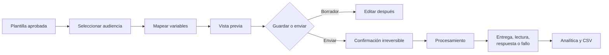

---

# 26. AUTOMATIZACIONES

Las automatizaciones reaccionan a eventos y ejecutan una secuencia lineal con
condiciones, esperas y acciones.

## 26.1 Disparadores disponibles

- Nuevo mensaje recibido.
- Primer mensaje entrante del contacto.
- Coincidencia de palabra clave.
- Respuesta a botón o fila de lista.
- Nuevo contacto creado.
- Conversación asignada.
- Etiqueta agregada.
- Programación por horario.

## 26.2 Pasos disponibles

- Enviar mensaje, botones, lista o plantilla.
- Agregar o quitar etiqueta.
- Asignar conversación de forma rotativa o a un agente específico.
- Actualizar un campo del contacto.
- Crear un negocio.
- Esperar minutos, horas o días.
- Evaluar condición Sí/No.
- Enviar un webhook.
- Cerrar la conversación.

## 26.3 Crear una automatización

1. Abrir **Automatizaciones**.
2. Pulsar **Crear automatización** o elegir una plantilla de inicio rápido.
3. Escribir un nombre.
4. Elegir el disparador y completar su configuración.
5. Pulsar **Agregar paso**.
6. Configurar cada acción y usar **Subir/Bajar** para ordenar.
7. En condiciones, completar las ramas **Sí** y **No**.
8. Guardar como borrador.
9. Revisar cuidadosamente mensajes, destinatarios y webhooks.
10. Activar.

## 26.4 Operar y auditar

Desde la lista se puede activar, pausar, editar, duplicar, eliminar y abrir
**Registros de ejecución**. Los registros muestran contacto, resultado y pasos
con estado **éxito**, **parcial** o **fallida**.

Una automatización activa de **Nuevo mensaje recibido** o **Palabra clave** tiene
prioridad sobre la respuesta automática de IA para evitar mensajes duplicados.

---

# 27. FLUJOS CONVERSACIONALES (BETA)

Los flujos modelan conversaciones ramificadas con nodos conectados. Son adecuados
para menús, preguntas frecuentes, captura de datos y triaje.

## 27.1 Activadores

- Mensaje con palabra clave.
- Primer mensaje entrante.
- Activación manual.

## 27.2 Nodos principales

- Inicio.
- Enviar mensaje.
- Enviar botones.
- Enviar lista.
- Enviar contenido multimedia.
- Capturar entrada en una variable.
- Condición Si/Entonces.
- Agregar o quitar etiqueta.
- Transferir a agente con nota interna.
- Finalizar.

## 27.3 Crear un flujo

1. Abrir **Flujos**.
2. Pulsar **Nuevo flujo**.
3. Elegir una plantilla o comenzar en blanco.
4. Configurar el disparador.
5. Agregar un nodo de inicio y definirlo como entrada.
6. Agregar y conectar nodos de mensajes, decisiones y acciones.
7. Mantener estables las claves internas de nodo para preservar analíticas.
8. Definir política de respuestas desconocidas, repreguntas y tiempo de espera.
9. Corregir los problemas indicados por el validador.
10. Guardar y activar.

## 27.4 Revisar ejecuciones

1. Abrir el flujo.
2. Entrar en **Ejecuciones**.
3. Consultar las 50 ejecuciones más recientes.
4. Expandir una fila para ver eventos, variables capturadas y duración.

Estados posibles: activa, completada, transferida, tiempo agotado, pausada por
agente o fallida. Si un flujo consume el mensaje entrante, la IA automática no
interviene en ese turno.

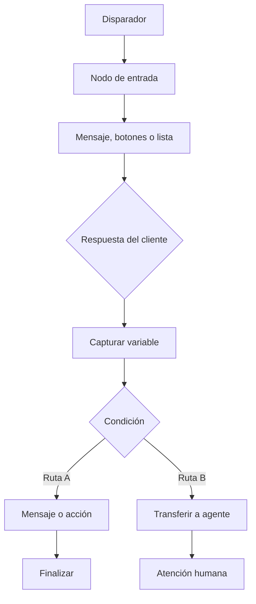

---

# 28. AGENTES DE IA

La configuración detallada de respuesta automática y transferencia se encuentra
en la Parte I de este manual. El módulo también ofrece:

## 28.1 Borradores asistidos

1. Abrir una conversación.
2. Pulsar el icono de IA del compositor.
3. Esperar el borrador basado en conversación y conocimiento.
4. Revisar y editar el texto.
5. Enviar manualmente.

El borrador no se envía solo y no aparece al cliente hasta que el agente pulse
**Enviar**.

## 28.2 Playground

Permite probar la personalidad, base de conocimiento y decisiones de derivación
sin afectar conversaciones reales. Reiniciar la simulación entre escenarios para
evitar que un caso anterior altere el contexto.

## 28.3 Base de conocimiento

- Crear, editar y eliminar documentos.
- Usar búsqueda por palabras clave de forma predeterminada.
- Configurar una **Clave de servicios OpenAI** para búsqueda semántica y, cuando
	corresponda, para transcripción y síntesis de audio.
- Reindexar después de habilitar o cambiar embeddings.

## 28.4 Configurar el nivel de audio

La configuración está en:

**Menú lateral > Agentes de IA > Configuración > Comportamiento > Gestión de audio**

Para habilitar el selector:

1. Ingresar con rol de propietario o administrador.
2. Activar **Activar asistente de IA**.
3. Activar **Responder automáticamente a mensajes entrantes**.
4. Elegir uno de los tres niveles:
	- **Solo texto**: recibe y conserva las notas de voz, pero no las transcribe ni
	  genera respuestas automáticas para ellas. Es el nivel predeterminado y el de
	  menor costo.
	- **Audio inicial**: procesa una nota de voz únicamente cuando es el primer
	  mensaje del cliente en la conversación. Transcribe la solicitud, la atiende y
	  responde con una voz femenina latinoamericana y respetuosa que pide continuar
	  por texto. Las notas de voz posteriores no se procesan con IA.
	- **Audio completo**: transcribe todas las notas de voz recibidas y responde con
	  voz. Los mensajes escritos siguen recibiendo respuestas escritas.
5. Pulsar **Guardar**.

Si el proveedor de chat es OpenAI, el audio usa la clave principal. Si se utiliza
Anthropic, Gemini u OpenRouter, se debe configurar también la **Clave de servicios
OpenAI**. El sistema no permite guardar un modo de audio sin una clave compatible.

La transcripción, la generación de la respuesta y la síntesis de voz pueden tener
costos separados. Si la síntesis de voz falla después de generar la respuesta, el
cliente recibe el mismo contenido por texto.

### Comprobación rápida

1. En **Solo texto**, enviar una nota de voz y confirmar que aparece en la bandeja
	sin respuesta automática.
2. En **Audio inicial**, iniciar una conversación nueva con una nota de voz y
	confirmar la respuesta hablada y la solicitud de continuar por texto. Enviar un
	segundo audio y confirmar que no se procesa automáticamente.
3. En **Audio completo**, enviar una nota de voz y confirmar que su transcripción
	queda disponible para el contexto y que se recibe una respuesta de voz.

## 28.5 Uso

La pestaña **Uso** muestra consumo de tokens por fecha, modo y modelo. No guarda
el contenido de los mensajes en el registro de uso. El costo corresponde a la
clave del proveedor configurado por la organización.

---

# PARTE III. CONFIGURACIÓN, ADMINISTRACIÓN E INTEGRACIONES

# 29. CONFIGURACIÓN DE WHATSAPP

## 29.1 Requisitos de Meta

- Una app empresarial en Meta for Developers.
- Producto WhatsApp agregado a la app.
- Phone Number ID.
- ID de la cuenta de WhatsApp Business o WABA ID.
- Token de acceso permanente.
- Token personalizado de verificación del webhook.
- PIN de dos pasos cuando corresponda a un número de producción.

## 29.2 Conectar la cuenta

1. Abrir **Configuración > WhatsApp**.
2. Completar Phone Number ID y WABA ID con identificadores numéricos, no con el
	 número telefónico visible.
3. Ingresar el token de acceso permanente.
4. Crear e ingresar el token de verificación del webhook.
5. Ingresar el PIN de dos pasos cuando sea necesario.
6. Pulsar **Guardar configuración**.
7. Pulsar **Probar conexión con la API** o **Verificar con Meta**.
8. Confirmar credenciales válidas, WABA suscrita y número registrado.

## 29.3 Configurar el webhook en Meta

1. Copiar la **URL de callback del webhook** mostrada por el CRM.
2. En Meta, abrir la configuración de WhatsApp y editar Webhook.
3. Pegar la URL de callback.
4. Ingresar exactamente el mismo token de verificación.
5. Suscribirse al campo `messages`.
6. Enviar un mensaje de prueba al número y verificar su llegada a la Bandeja.

## 29.4 Conservar adjuntos

Meta puede dejar inaccesibles los archivos recibidos después de aproximadamente
30 días. Activar **Conservar adjuntos entrantes** para copiar fotos, videos,
audios y documentos al almacenamiento propio. Los archivos mayores de 16 MB no
se copian mediante esta función.

---

# 30. PERFIL, SEGURIDAD Y APARIENCIA

## Perfil

1. Abrir **Configuración > Tu perfil**.
2. Editar nombre para mostrar y correo.
3. Subir avatar PNG, JPG, WebP o GIF de hasta 2 MB.
4. Guardar cambios.
5. Si se cambia el correo, completar las confirmaciones recibidas.

## Acceso y seguridad

1. Abrir **Configuración > Acceso y seguridad**.
2. Cambiar la contraseña usando al menos la longitud indicada.
3. Cerrar las demás sesiones si existe sospecha de acceso no autorizado.

## Apariencia

1. Abrir **Configuración > Apariencia**.
2. Elegir modo claro u oscuro.
3. Elegir el color de acento.

La apariencia es una preferencia local del usuario y no cambia el aspecto para
los demás miembros.

---

# 31. MIEMBROS, INVITACIONES Y PROPIEDAD

## 31.1 Invitar un miembro

1. Abrir **Configuración > Miembros del equipo**.
2. Pulsar **Invitar miembro**.
3. Elegir rol: Coordinador / Administrador, Agente u Observador.
4. Elegir vigencia del enlace: 1, 7 o 30 días.
5. Agregar una etiqueta interna opcional.
6. Pulsar **Generar enlace**.
7. Copiarlo o enviarlo por WhatsApp antes de cerrar el diálogo.

El enlace de texto completo se muestra una sola vez y es de un único uso. Si se
pierde, revocar la invitación pendiente y crear otra.

## 31.2 Administrar miembros

- Cambiar el rol desde la lista de miembros.
- Revisar presencia en línea, ausente o desconectada.
- Revocar invitaciones pendientes.
- Quitar miembros que ya no deben acceder.

Al quitar a un miembro se cierra su acceso a la cuenta compartida. La propiedad
solo puede transferirla el Propietario y debe existir siempre un único propietario.

---

# 32. CLAVES DE API Y API PÚBLICA

La API estable bajo `/api/v1` permite integrar sistemas externos sin operar la
interfaz gráfica.

## 32.1 Crear una clave

1. Abrir **Configuración > Claves de API**.
2. Pulsar **Nueva clave de API**.
3. Asignar un nombre relacionado con la integración.
4. Conceder únicamente los permisos necesarios.
5. Crear y copiar la clave inmediatamente.

La clave completa se muestra una sola vez. El CRM almacena únicamente su hash.
Revocar una clave perdida o comprometida y reemplazarla en la integración.

## 32.2 Permisos disponibles

| Permiso | Capacidad |
|---|---|
| `messages:send` | Enviar mensajes de WhatsApp. |
| `messages:read` | Leer mensajes y estados de entrega. |
| `contacts:read` | Consultar contactos. |
| `contacts:write` | Crear y actualizar contactos. |
| `conversations:read` | Consultar conversaciones. |
| `broadcasts:send` | Lanzar difusiones. |
| `webhooks:manage` | Registrar y administrar webhooks salientes. |

## 32.3 Operaciones principales

- Verificar identidad de la clave con `GET /api/v1/me`.
- Listar, crear o actualizar contactos.
- Listar conversaciones y mensajes.
- Enviar texto, plantilla o contenido multimedia.
- Lanzar y consultar difusiones.
- Registrar webhooks salientes.

Las solicitudes usan `Authorization: Bearer <clave>`. El límite predeterminado
es de 120 solicitudes por minuto y por clave. Una difusión iniciada por API admite
hasta 1000 destinatarios por solicitud.

La referencia técnica completa está en `docs/public-api.md`.

---

# 33. WEBHOOKS

Existen dos direcciones diferentes:

## Webhook entrante de Meta

- Meta envía mensajes y estados al CRM.
- Usa la URL configurada en **Configuración > WhatsApp**.
- La firma de Meta se valida antes de procesar el evento.

## Webhooks salientes de la API pública

- El CRM informa eventos a un sistema externo.
- Se crean con una clave que posea `webhooks:manage`.
- Las entregas se firman mediante HMAC para permitir su verificación.
- Entre los eventos disponibles se encuentran mensajes recibidos y cambios de
	estado de difusiones.

El receptor debe validar la firma, responder rápidamente con código exitoso y
procesar reintentos de forma idempotente.

---

# 34. SERVIDOR MCP

El servidor MCP permite consultar y operar el CRM desde asistentes compatibles
como Claude Desktop, Claude Code o Cursor. Utiliza internamente la API pública.

## 34.1 Configuración básica

1. Crear una clave de API con permisos mínimos de lectura.
2. Configurar `WACRM_BASE_URL` con la URL del CRM.
3. Configurar `WACRM_API_KEY` con la clave creada.
4. Ejecutar el paquete `wacrm-mcp` desde el cliente MCP.
5. Verificar la conexión con la herramienta de identidad.

## 34.2 Seguridad

- El servidor es de solo lectura por defecto.
- Para escrituras se requiere `WACRM_ENABLE_WRITES=true` y permisos de API.
- Para difusiones se requiere además `WACRM_ENABLE_BROADCASTS=true`.
- El lanzamiento de una difusión exige confirmación explícita.

Nunca otorgar permisos de escritura o difusión a un asistente que solo necesita
consultar datos. La guía completa está en `docs/mcp.md`.

---

# 35. FLUJOS DE TRABAJO ENTRE MÓDULOS

## 35.1 Del mensaje a la oportunidad comercial

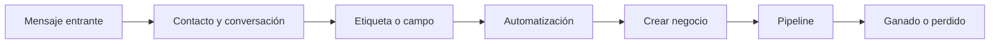

Procedimiento:

1. El cliente escribe y se crea o actualiza su contacto.
2. Un agente o automatización clasifica el contacto.
3. Se crea un negocio asociado.
4. El equipo mueve el negocio por las etapas.
5. Las métricas aparecen en Pipelines y Panel.

## 35.2 De segmentación a campaña

1. Crear etiquetas o campos personalizados.
2. Completar esos datos en los contactos.
3. Crear y aprobar una plantilla.
4. Crear una difusión con la segmentación.
5. Enviar y revisar entrega, lectura, respuesta y fallos.
6. Atender las respuestas desde la Bandeja.

## 35.3 De conversación automática a atención humana

1. Un flujo, automatización o IA atiende el mensaje.
2. La lógica determina que se necesita una persona.
3. El sistema pausa o finaliza la ejecución automática.
4. Asigna la conversación o la deja en cola.
5. El responsable recibe una notificación.
6. El agente responde y actualiza el estado.

---

# 36. LÍMITES OPERATIVOS Y SEGURIDAD

| Elemento | Regla o límite operativo |
|---|---|
| Ventana de WhatsApp | 24 horas para mensajes libres; después usar plantilla. |
| Teléfonos | Formato internacional E.164. |
| Adjuntos conservados | Se omiten archivos mayores de 16 MB. |
| Avatar | Hasta 2 MB. |
| Variables de plantilla | Contiguas desde `{{1}}`; completar ejemplos. |
| API pública | 120 solicitudes por minuto y clave. |
| Difusión por API | Hasta 1000 destinatarios por solicitud. |
| Flujos | Funcionalidad Beta; probar antes de producción. |
| Claves y enlaces | La clave API y URL de invitación se muestran una sola vez. |
| Observador | Solo lectura en toda la aplicación. |
| Credenciales | No compartir tokens, PIN, claves API ni secretos por chat. |

Buenas prácticas:

- Aplicar el principio de menor privilegio.
- Probar plantillas, difusiones, automatizaciones y flujos con una audiencia pequeña.
- Revisar registros antes de reactivar una automatización fallida.
- Revocar inmediatamente claves o invitaciones comprometidas.
- Mantener copias de seguridad y supervisar el almacenamiento de adjuntos.
- Verificar regularmente la conexión y suscripción de Meta.

---

# 37. LISTA DE VERIFICACIÓN DE PUESTA EN MARCHA

- [ ] Cuenta creada y Propietario identificado.
- [ ] Miembros invitados con el rol mínimo necesario.
- [ ] Perfil, seguridad y moneda configurados.
- [ ] WhatsApp conectado, registrado y webhook `messages` verificado.
- [ ] Mensaje entrante y saliente de prueba completados.
- [ ] Plantillas aprobadas sincronizadas.
- [ ] Etiquetas y campos personalizados definidos.
- [ ] Contactos importados y duplicados revisados.
- [ ] Pipeline y etapas configurados.
- [ ] Respuestas rápidas creadas.
- [ ] Automatizaciones probadas y registros revisados.
- [ ] Flujos Beta probados antes de activarlos.
- [ ] IA, conocimiento, límite y destino de derivación configurados.
- [ ] Pruebas de transferencia humana completadas.
- [ ] Notificaciones internas y del navegador verificadas.
- [ ] Claves API limitadas a los permisos necesarios.
- [ ] Responsables de la cola sin asignar definidos.
- [ ] Copias de seguridad de base de datos, Storage y secretos verificadas.
- [ ] Migraciones aplicadas y estado de Prisma comprobado.
- [ ] Tareas cron externas configuradas cuando se usan esperas o flujos.
- [ ] Monitorización del contenedor y cuota de Storage activa.

---

# PARTE IV. DESPLIEGUE, MANTENIMIENTO Y RECUPERACIÓN

# 38. DESPLIEGUE CON DOCKER

La imagen ejecuta la aplicación Next.js como usuario sin privilegios. La base de
datos y el almacenamiento pertenecen a un proyecto Supabase externo; el archivo
`docker-compose.yml` no crea un contenedor local de base de datos.

## 38.1 Requisitos

- Docker Engine y Docker Compose.
- Proyecto Supabase operativo.
- Archivo `.env.local` completo y protegido.
- Acceso directo a PostgreSQL para aplicar migraciones.
- Dominio HTTPS accesible desde Meta para producción.

## 38.2 Preparar la configuración

1. Copiar `.env.local.example` como `.env.local`.
2. Completar todas las variables marcadas como obligatorias.
3. Definir `NEXT_PUBLIC_SITE_URL` con la URL pública canónica.
4. Elegir `NEXT_PUBLIC_APP_LOCALE=es` para construir la interfaz en español.
5. Mantener `.env.local` fuera del control de versiones.
6. Restringir su lectura al personal y procesos autorizados.

Las variables `NEXT_PUBLIC_*` se incorporan al cliente durante la construcción.
Después de cambiar una de ellas es obligatorio reconstruir la imagen. Los demás
secretos se leen en tiempo de ejecución y normalmente requieren reiniciar el
contenedor, no reconstruirlo.

## 38.3 Aplicar la base de datos

Antes de iniciar una versión nueva:

1. Crear una copia de seguridad verificable.
2. Configurar `DIRECT_URL` con la conexión directa de Supabase, puerto `5432`.
3. Ejecutar `npm run db:migrate:status`.
4. Revisar las migraciones pendientes.
5. Ejecutar `npm run db:migrate:deploy`.
6. Repetir `npm run db:migrate:status` y confirmar que el esquema esté actualizado.

El contenedor de la aplicación **no ejecuta migraciones automáticamente**.

## 38.4 Construir e iniciar

```powershell
docker compose --env-file .env.local up --build -d
```

La aplicación queda publicada normalmente en `http://localhost:3000`. Para usar
otro puerto del host, definir `HOST_PORT`, por ejemplo `HOST_PORT=8080`. No usar
`PORT` para cambiar el puerto publicado: el servidor está fijado al puerto 3000
dentro del contenedor.

## 38.5 Verificar el despliegue

1. Consultar el estado de los servicios:

	```powershell
	docker compose --env-file .env.local ps
	```

2. Confirmar que el healthcheck indique un estado saludable.
3. Abrir la aplicación desde la URL pública.
4. Iniciar sesión.
5. Enviar y recibir un mensaje de WhatsApp de prueba.
6. Verificar Bandeja, archivos adjuntos, notificaciones y tiempo real.
7. Revisar los registros ante cualquier error:

	```powershell
	docker compose --env-file .env.local logs app
	```

## 38.6 Actualizar una instalación

1. Anunciar la ventana de mantenimiento.
2. Crear copias de seguridad.
3. Obtener la nueva versión del código o imagen.
4. Revisar cambios en `.env.local.example` y agregar variables nuevas.
5. Aplicar migraciones pendientes.
6. Reconstruir e iniciar:

	```powershell
	docker compose --env-file .env.local up --build -d
	```

7. Ejecutar las verificaciones funcionales del apartado 38.5.
8. Conservar temporalmente la imagen anterior para facilitar una reversión.

No se debe revertir una imagen sin evaluar primero si la nueva versión aplicó
migraciones incompatibles con el código anterior.

## 38.7 Programador externo obligatorio

Docker no incluye un planificador. Cuando se utilicen pasos **Esperar** en
automatizaciones o ejecuciones diferidas de flujos, un servicio externo debe
invocar periódicamente:

- `GET /api/automations/cron`
- `GET /api/flows/cron`

Cada solicitud debe enviar el secreto compartido en la cabecera
`x-cron-secret`. El servidor responde `503` mientras
`AUTOMATION_CRON_SECRET` no esté configurado.

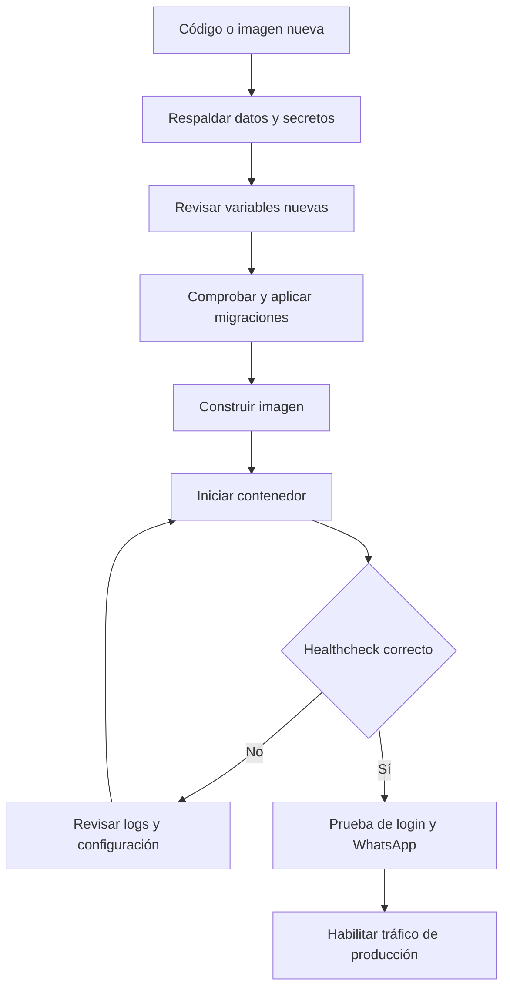

---

# 39. VARIABLES, CREDENCIALES Y SECRETOS

## 39.1 Variables esenciales

| Variable | Uso | Tratamiento |
|---|---|---|
| `NEXT_PUBLIC_SUPABASE_URL` | URL pública del proyecto Supabase | Visible en cliente. Requiere reconstrucción al cambiar. |
| `NEXT_PUBLIC_SUPABASE_ANON_KEY` | Clave pública para acceso sujeto a RLS | Visible en cliente. No sustituye la clave de servicio. |
| `SUPABASE_SERVICE_ROLE_KEY` | Operaciones servidor que omiten RLS | Secreto crítico; nunca exponer al navegador. |
| `DATABASE_URL` | Conexión PostgreSQL agrupada | Secreto de servidor. |
| `DIRECT_URL` | Conexión directa para migraciones | Secreto de servidor. |
| `ENCRYPTION_KEY` | Cifrado AES-256-GCM de credenciales almacenadas | Secreto crítico y parte obligatoria del respaldo. |
| `META_APP_SECRET` | Validación de firmas de webhooks de Meta | Secreto crítico de servidor. |
| `AUTOMATION_CRON_SECRET` | Autoriza tareas cron internas | Secreto largo y aleatorio. |

## 39.2 Protección de `ENCRYPTION_KEY`

La clave debe contener 64 caracteres hexadecimales, equivalentes a 32 bytes.
Puede generarse con:

```powershell
node -e "console.log(require('crypto').randomBytes(32).toString('hex'))"
```

Guardar esta clave en un gestor de secretos y en una copia de recuperación
cifrada. Si se pierde o cambia sin una migración planificada, las credenciales
cifradas previamente dejan de poder leerse y cada cuenta deberá volver a guardar
su configuración de WhatsApp e IA.

## 39.3 Rotación de secretos

1. Identificar todos los servicios que utilizan el secreto.
2. Preparar la credencial nueva sin eliminar todavía la anterior cuando el
	proveedor permita coexistencia.
3. Actualizar el gestor de secretos y `.env.local`.
4. Reiniciar el servicio.
5. Probar la operación afectada.
6. Revocar la credencial anterior.
7. Registrar fecha, responsable y resultado sin guardar el valor secreto.

Para `ENCRYPTION_KEY`, no aplicar una rotación directa: requiere descifrar con la
clave anterior y volver a cifrar con la nueva, o pedir a los usuarios que vuelvan
a registrar todas las credenciales.

---

# 40. COPIAS DE SEGURIDAD Y RECUPERACIÓN

Una copia completa debe considerar cuatro elementos separados:

1. Base de datos PostgreSQL.
2. Objetos de Supabase Storage, especialmente el bucket `chat-media`.
3. Secretos y variables de entorno.
4. Configuración de infraestructura: dominio, proxy, cron y despliegue.

## 40.1 Base de datos

Usar las copias administradas o recuperación a un punto en el tiempo disponibles
en el plan de Supabase. Como alternativa adicional, crear una exportación con las
herramientas estándar de PostgreSQL usando una conexión autorizada.

Frecuencia recomendada:

| Entorno | Frecuencia mínima sugerida |
|---|---|
| Desarrollo | Antes de cambios destructivos. |
| Pruebas | Antes de actualizar esquema o cargar datos masivos. |
| Producción | Diaria y antes de cada despliegue con migraciones. |

La existencia de un archivo no demuestra que el respaldo funcione. Restaurar
periódicamente en un proyecto aislado y validar tablas, relaciones, funciones,
triggers, políticas RLS y una muestra de conversaciones.

## 40.2 Archivos de Storage

Los adjuntos archivados se guardan en Supabase Storage. La copia de la base de
datos no necesariamente contiene los objetos binarios del bucket. Establecer un
procedimiento separado para copiar `chat-media` y cualquier bucket adicional.

Supervisar la cuota: el volumen crece con los mensajes entrantes. Los archivos
mayores de 16 MB no se archivan y los adjuntos recibidos mientras la conservación
está desactivada pueden desaparecer cuando Meta deje de servirlos.

## 40.3 Secretos e infraestructura

Respaldar de manera cifrada:

- `.env.local` o sus valores equivalentes en el gestor de secretos.
- `ENCRYPTION_KEY`.
- Configuración del proxy HTTPS y dominio.
- Definiciones del programador cron.
- Referencias de proyectos Supabase y aplicaciones Meta.

No almacenar secretos en el repositorio, el manual, tickets ni conversaciones.

## 40.4 Procedimiento de recuperación

1. Declarar el incidente y detener escrituras si pueden agravar el daño.
2. Identificar el último respaldo válido y el punto objetivo de recuperación.
3. Crear un entorno Supabase aislado para la restauración.
4. Restaurar PostgreSQL.
5. Restaurar los objetos de Storage.
6. Reponer secretos desde el gestor seguro.
7. Desplegar una versión de aplicación compatible con el esquema restaurado.
8. Ejecutar `npm run db:migrate:status` sin aplicar cambios automáticamente.
9. Validar autenticación, permisos, contactos, mensajes, adjuntos y configuración.
10. Probar envío y recepción con un número controlado.
11. Cambiar DNS o configuración de producción solo después de aprobar las pruebas.
12. Documentar pérdida de datos, tiempos y acciones correctivas.

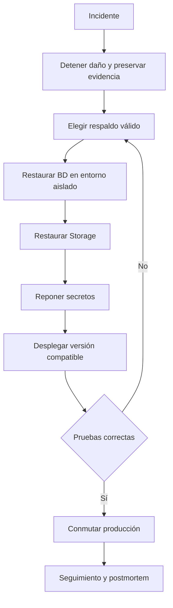

---

# 41. MIGRACIONES DE BASE DE DATOS

`prisma/migrations/` es la fuente de verdad del esquema de la aplicación. Prisma
requiere `DIRECT_URL`; no debe ejecutar DDL mediante la conexión agrupada de
PgBouncer.

## 41.1 Comandos operativos

```powershell
npm run db:migrate:status
npm run db:migrate:deploy
npm run db:generate
```

- `db:migrate:status`: informa migraciones aplicadas y pendientes.
- `db:migrate:deploy`: aplica migraciones existentes en producción.
- `db:generate`: regenera el cliente Prisma.

`db:migrate:dev` se reserva para crear migraciones durante desarrollo. Las
migraciones de este proyecto también pueden requerir SQL manual para RLS,
funciones, triggers y Storage; Prisma no genera esos elementos por sí solo.

## 41.2 Proyecto Supabase nuevo

1. Confirmar que se trata del proyecto correcto.
2. Configurar `DIRECT_URL`.
3. No marcar migraciones como aplicadas.
4. Ejecutar `npm run db:migrate:deploy`.
5. Ejecutar `npm run db:migrate:status`.
6. Realizar las pruebas de puesta en marcha.

Los esquemas administrados `auth` y `storage` ya contienen objetos en un proyecto
Supabase nuevo. Su existencia puede provocar Prisma `P3005` aunque las tablas de
la aplicación todavía no existan.

## 41.3 Base de datos existente y baselining

Solo realizar baselining cuando las tablas y cambios de las migraciones ya estén
presentes en la base de datos.

1. Crear una copia de seguridad.
2. Verificar una muestra de tablas conocidas de la aplicación en el esquema
	`public`; no asumir que la base está migrada porque `auth` o `storage` tengan
	tablas.
3. Comparar el historial anterior con las carpetas de `prisma/migrations`.
4. Marcar como aplicadas únicamente las migraciones cuyo DDL ya exista.
5. Ejecutar `npm run db:migrate:status`.
6. Aplicar cualquier migración realmente pendiente con
	`npm run db:migrate:deploy`.

Ejemplo de marcado individual:

```powershell
npx prisma migrate resolve --applied <nombre_de_migracion>
```

No ejecutar este comando masivamente en una base nueva o parcialmente creada. Si
el historial indica que una migración está aplicada pero sus tablas no existen,
el libro mayor y el esquema están desalineados y debe corregirlos un responsable
de base de datos antes de continuar.

## 41.4 Regla de despliegue

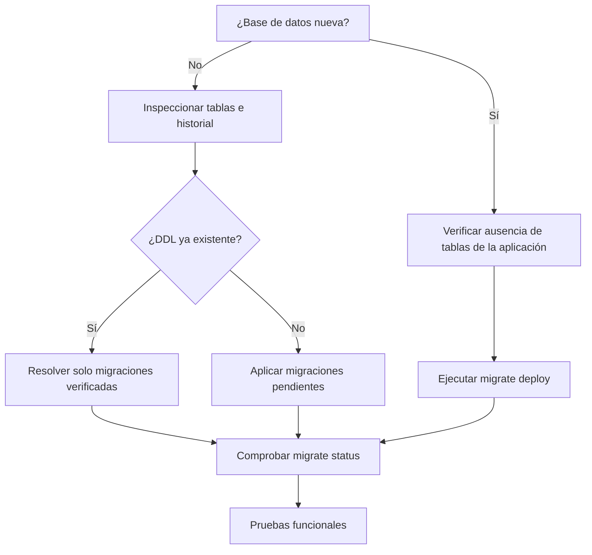

---

# 42. DIAGNÓSTICO AVANZADO DE WHATSAPP Y WEBHOOKS

## 42.1 Secuencia de conexión con Meta

Al guardar la configuración, el sistema comprueba en este orden:

| Paso | Operación | Qué valida |
|---|---|---|
| `verify_number` | Leer Phone Number ID | El token puede acceder al número. |
| `waba_phone_numbers` | Listar números del WABA | El número pertenece al WABA indicado. |
| `register` | Registrar el número, si se indicó PIN | El número puede recibir webhooks de Cloud API. |
| `subscribe_waba` | Suscribir aplicaciones del WABA | Meta enviará eventos a la aplicación. |

En un error, registrar el paso, código/subcódigo y `Trace ID`. No publicar tokens,
PIN ni secretos en tickets de soporte.

## 42.2 Credenciales válidas pero no llegan mensajes

1. Pulsar **Probar conexión con la API**.
2. Confirmar que el WABA esté suscrito a la aplicación.
3. Revisar el estado de registro del número.
4. Ingresar el PIN de dos pasos y guardar si el número no está registrado.
5. Pulsar **Verificar con Meta** y revisar cada comprobación.
6. En Meta, confirmar la URL:
	`https://<dominio>/api/whatsapp/webhook`.
7. Confirmar que el token de verificación coincida exactamente.
8. Confirmar la suscripción al campo `messages`.
9. Confirmar que `META_APP_SECRET` pertenezca a la aplicación que firma el evento.
10. Revisar que el proxy permita solicitudes públicas HTTPS hacia el webhook.
11. Consultar los logs del contenedor durante un envío de prueba.

## 42.3 Errores frecuentes

| Código o situación | Causa habitual | Acción |
|---|---|---|
| `190` | Token vencido o inválido | Generar token permanente de System User. |
| `10`, `200-299` | Permisos insuficientes | Otorgar gestión y mensajería de WhatsApp y asignar el WABA. |
| `100`, `33` | ID incorrecto o de otro negocio | Copiar Phone Number ID y WABA ID desde la misma cartera empresarial. |
| `133010` | Número no registrado | Guardar de nuevo con el PIN de dos pasos. |
| `133005`, `136025` | PIN incorrecto | Verificar o restablecer el PIN en WhatsApp Manager. |
| `131031`, `368` | Cuenta restringida | Revisar Calidad de la cuenta y apelar en Meta. |
| Límite de tasa | Exceso temporal de solicitudes | Esperar y reintentar; no cambiar credenciales. |
| `401` en webhook | Firma no coincide | Revisar `META_APP_SECRET` y aplicación emisora. |
| Error de red | Servidor sin acceso a Graph API | Permitir salida HTTPS hacia `graph.facebook.com`. |

## 42.4 Webhooks salientes

Cuando un sistema externo no recibe eventos:

1. Confirmar que el endpoint esté activo y use HTTPS.
2. Revisar que la suscripción incluya el evento esperado.
3. Validar la firma HMAC antes de procesar el contenido.
4. Responder rápidamente con un código exitoso.
5. Procesar eventos de forma idempotente porque pueden existir reintentos.
6. Correlacionar fecha, identificador del evento y logs del receptor.

---

# 43. TRANSFERENCIA DE PROPIEDAD DE LA CUENTA

La transferencia cambia tres elementos de manera atómica:

- El propietario actual pasa a Administrador.
- El miembro seleccionado pasa a Propietario.
- La cuenta actualiza su referencia de propietario.

Solo el Propietario actual puede ejecutar esta operación y el destino debe ser un
miembro de la misma cuenta. La interfaz de miembros actual no ofrece todavía un
botón de transferencia; el endpoint existe para una integración o herramienta
administrativa autenticada.

## 43.1 Preparación obligatoria

1. Confirmar por un segundo canal la identidad del nuevo propietario.
2. Verificar que aparezca como miembro activo de la cuenta.
3. Comprobar su `user_id`; no utilizar el identificador de perfil ni el correo.
4. Crear una copia de seguridad.
5. Acordar una ventana sin cambios administrativos simultáneos.
6. Mantener abiertas ambas sesiones hasta validar el resultado.

## 43.2 Operación mediante endpoint autenticado

La herramienta administrativa debe enviar:

```http
POST /api/account/transfer-ownership
Content-Type: application/json

{
  "newOwnerUserId": "UUID-del-miembro-destino"
}
```

La solicitud necesita la sesión autenticada del propietario actual. No usar una
clave API pública: esta operación no forma parte de `/api/v1`.

## 43.3 Verificación posterior

1. Confirmar respuesta exitosa `{ "ok": true }`.
2. Actualizar la aplicación en ambas sesiones.
3. Confirmar que el nuevo propietario vea el rol **Propietario**.
4. Confirmar que el anterior aparezca como **Administrador**.
5. Verificar acceso a miembros, IA, WhatsApp y configuración sensible.
6. Registrar quién autorizó y ejecutó el cambio.

No eliminar al propietario anterior hasta finalizar estas comprobaciones.

---

# 44. RESPUESTA A INCIDENTES

## 44.1 Clasificación inicial

| Nivel | Ejemplo | Acción inicial |
|---|---|---|
| Crítico | Fuga de secretos, pérdida de datos o acceso no autorizado | Contener inmediatamente y convocar responsables técnicos. |
| Alto | No entran mensajes, envíos masivos erróneos o aplicación caída | Detener procesos afectados y restaurar el servicio. |
| Medio | Una automatización falla o una función está degradada | Pausar la función y conservar evidencia. |
| Bajo | Error visual o caso aislado sin pérdida de servicio | Registrar y programar corrección. |

## 44.2 Procedimiento general

1. Registrar hora, alcance, cuentas y síntomas.
2. Preservar logs y evidencia; no publicar secretos.
3. Contener el problema:
	- Pausar automatizaciones, flujos o difusiones afectadas.
	- Revocar claves comprometidas.
	- Detener el contenedor si continuar causa daño.
4. Identificar el último cambio de código, configuración o credenciales.
5. Recuperar el servicio con el cambio mínimo comprobable.
6. Validar autenticación, WhatsApp, datos y permisos.
7. Informar a los responsables operativos.
8. Mantener observación reforzada después de recuperar.
9. Elaborar un análisis posterior con causa, impacto y prevención.

## 44.3 Credencial comprometida

1. Revocar la credencial en su sistema de origen.
2. Generar una nueva con el privilegio mínimo.
3. Actualizar el gestor de secretos y reiniciar servicios.
4. Revisar logs y actividad durante el período de exposición.
5. Rotar credenciales relacionadas cuando exista riesgo de movimiento lateral.
6. Documentar el incidente sin registrar los valores secretos.

---

# 45. RECURSOS Y DOCUMENTACIÓN TÉCNICA

- API pública: `docs/public-api.md`
- Servidor MCP: `docs/mcp.md`
- Docker: `docs/docker.md`
- Varias cuentas WABA: `docs/multi-waba.md`
- Migraciones de Prisma: `docs/prisma-migrations.md`
- Solución de conexión WhatsApp: `docs/whatsapp-connection-troubleshooting.md`

## Recursos audiovisuales

- https://www.youtube.com/watch?v=ef69Z36ai9M&t=330s
- https://www.youtube.com/watch?v=0FxtWK_otxU
